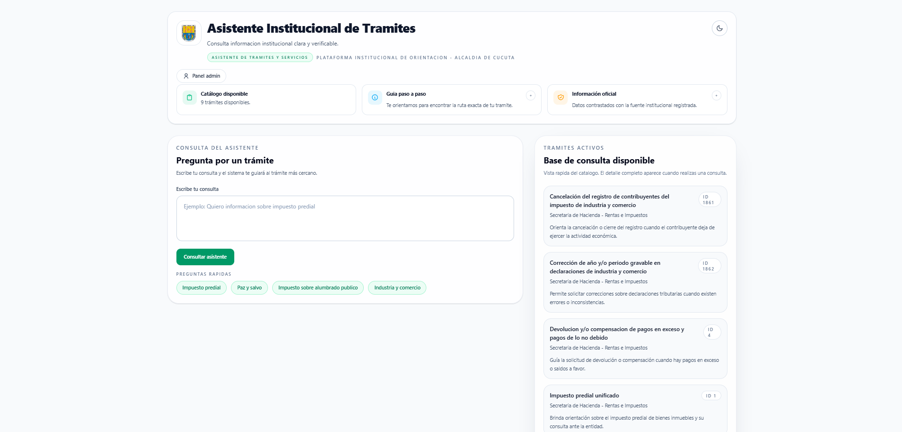
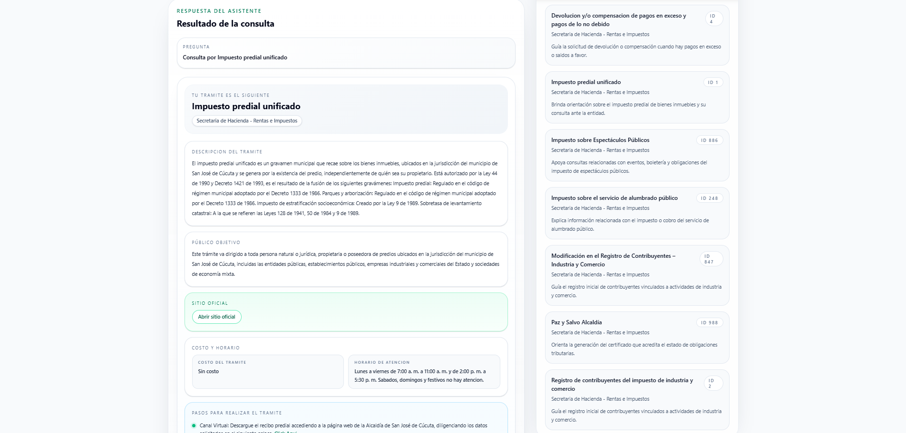
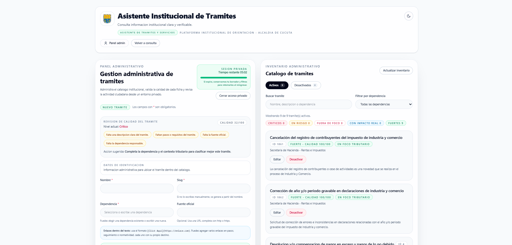
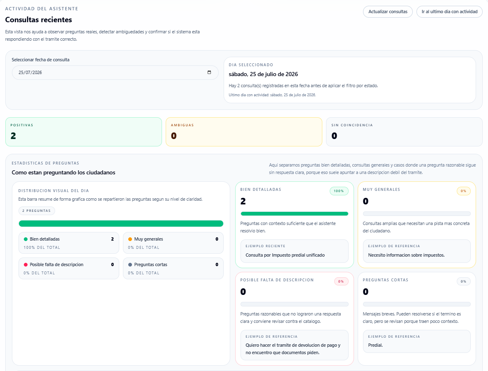

🤖 AI Citizen Assistant

[Python] [FastAPI] [React] [PostgreSQL] [RAG] [Vercel]

Asistente inteligente para la orientación ciudadana mediante IA.

Asistente inteligente desarrollado para orientar a los ciudadanos sobre los trámites del sector de Rentas e Impuestos de la Alcaldía de San José de Cúcuta.

El sistema utiliza una arquitectura **Retrieval-Augmented Generation (RAG)** combinada con búsqueda semántica mediante embeddings para ofrecer respuestas precisas y contextualizadas.

---

## 🚀 Demo

🌐 Aplicación en producción

https://asistente-alcaldia-cucuta.vercel.app

---

## Capturas del sistema

### Inicio



### Consulta ciudadana



### Panel administrativo



### Estadísticas



---

# 📌 Características principales

- ✅ Consulta inteligente mediante lenguaje natural
- ✅ Arquitectura RAG (Retrieval-Augmented Generation)
- ✅ Búsqueda semántica con pgvector
- ✅ Embeddings almacenados en PostgreSQL
- ✅ CRUD administrativo de trámites
- ✅ Panel de administración
- ✅ Estadísticas de consultas ciudadanas
- ✅ Manejo de consultas ambiguas
- ✅ Autenticación mediante JWT
- ✅ Interfaz responsive
- ✅ Despliegue en Vercel

---

# 🛠 Tecnologías utilizadas

## Frontend

- React
- Vite
- Tailwind CSS
- JavaScript

## Backend

- Python
- FastAPI
- PostgreSQL
- pgvector
- SQLAlchemy
- JWT Authentication

## Herramientas

- Git
- GitHub
- Vercel
- REST API

---

# 🧠 Arquitectura

```
Ciudadano
      │
      ▼
Frontend (React)
      │
      ▼
Backend (FastAPI)
      │
      ▼
PostgreSQL + pgvector
      │
      ▼
Embeddings
      │
      ▼
Búsqueda semántica
      │
      ▼
Respuesta al ciudadano
```

---

# ⚙ Funcionalidades

## Consulta ciudadana

- Consultas mediante lenguaje natural
- Recuperación semántica de información
- Respuestas contextualizadas
- Detección de preguntas ambiguas
- Recomendaciones automáticas
- Sugerencias inteligentes

---

## Panel administrativo

- Crear trámites
- Editar trámites
- Eliminar trámites
- Reactivar trámites
- Dashboard administrativo
- Registro de consultas
- Estadísticas
- Gestión de inventario
- Protección mediante JWT

---

# 📂 Estructura del proyecto

```
backend/
│
├── app/
├── scripts/
├── tests/

frontend/
│
├── src/
├── public/

docs/

README.md
```

---

# 🔗 API

## Principales Endpoints

```
GET     /api/health

GET     /api/tramites

GET     /api/tramites/{id}

POST    /api/admin/tramites

PUT     /api/admin/tramites/{id}

DELETE  /api/admin/tramites/{id}

GET     /api/admin/consultas

POST    /api/consulta
```

---

# ▶ Instalación

## Clonar repositorio

```bash
git clone https://github.com/moisescpp/asistente-alcaldia-cucuta.git
```

---

## Backend

```bash
cd backend

python -m venv .venv

.venv\Scripts\activate

pip install -r requirements.txt

uvicorn app.main:app --reload
```

---

## Frontend

```bash
cd frontend

npm install

npm run dev
```

---

# ✅ Pruebas

```bash
pytest -q
```

Resultado de validación

```
61 Passed
1 Skipped
```

También se validó correctamente:

- Backfill de embeddings
- Auditoría de calidad
- Validación de consultas RAG

---

# 🎯 Objetivos del proyecto

- Mejorar la orientación ciudadana mediante IA.
- Reducir consultas repetitivas.
- Facilitar el acceso a los trámites.
- Implementar recuperación semántica.
- Centralizar la administración de trámites.
- Proporcionar métricas para mejorar el servicio.

---

# 🚀 Próximas mejoras

- Docker
- CI/CD
- Redis
- Caché semántico
- Historial de conversaciones
- Login con OAuth
- Dashboard avanzado
- Integración con modelos LLM más recientes

---

# 👨‍💻 Autor

## Moisés Camilo Pérez Prieto

Ingeniero de Sistemas

📍 Cúcuta, Colombia

### LinkedIn

https://linkedin.com/in/moisescamiloperez

### GitHub

https://github.com/moisescpp

---

⭐ Si este proyecto te resulta interesante, no olvides dejar una estrella en el repositorio.
